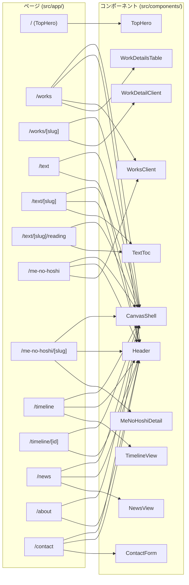
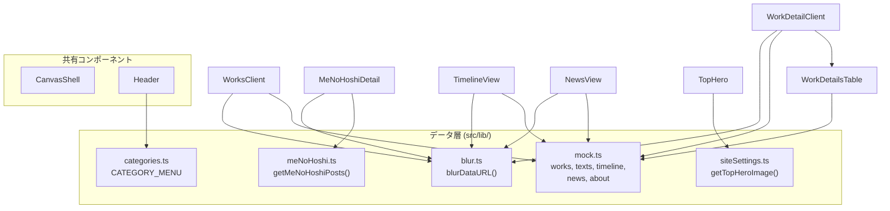
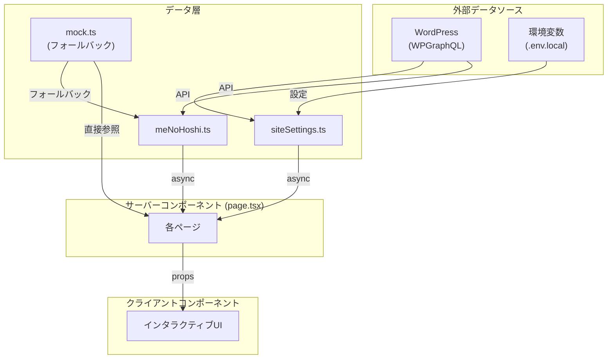

# プロジェクト構造図

## ページ → コンポーネント依存関係



## コンポーネント間の依存



## レイアウト構造ツリー

```
RootLayout (layout.tsx)
├── ThemeScript        … SSRフリッカー防止
├── ThemeToggle        … ダーク/ライト切替（固定位置）
└── GridDebugOverlay   … Ctrl+G でグリッド表示（dev用）

各ページ共通:
CanvasShell (<main class="page-shell">)
└── Header
    ├── ブランド名 (HAYATO KANO)
    ├── デスクトップナビ (Works / Text / 目の星 / ...)
    ├── カテゴリ行 (All / Photography / Video / ...)
    ├── 検索
    └── モバイルメニュー
```

## ページ別レイアウト

```
/ (トップ)
└── TopHero (全画面ヒーロー)
    ├── 背景画像 + ホバー切替
    ├── 左下: 最新Works一覧 (列1-4)
    └── 右下: ナビメニュー (列5-12)

/works (一覧)
└── WorksClient
    ├── グリッド表示 (auto-fit, minmax 190px)
    └── リスト表示 (12カラム subgrid)
        └── WorkDetailsTable

/works/[slug] (詳細)
└── WorkDetailClient
    ├── ギャラリーモード (全画面スライドショー)
    ├── インデックスモード (グリッド一覧)
    └── ディテールオーバーレイ
        └── WorkDetailsTable (subgrid)

/me-no-hoshi/[slug] (詳細)
└── MeNoHoshiDetail (2カラム)
    ├── 左: タイトル + DETAILS テーブル + BIO + ステートメント
    └── 右: KEY VISUAL + PAST WORKS + ARCHIVE

/timeline
└── TimelineView (12カラムグリッド)
    ├── フィルタタブ (すべて / 写真 / テキスト)
    ├── 日付グルーピング + 投稿一覧
    └── アーカイブサイドバー (列10-12)

/text/[slug]
├── 本文 (左)
└── TextToc 目次 (右サイドバー)

/news
└── NewsView (アコーディオン)
    └── 各記事: summary行 + detail展開

/about (2カラム)
├── 左: ステートメント + CV
└── 右: 写真一覧

/contact
└── ContactForm
```

## データフロー



## ファイル一覧と影響度

| ファイル | 依存先の数 | 影響度 |
|---------|-----------|--------|
| `lib/mock.ts` | 8+ | **高** |
| `lib/blur.ts` | 6+ | **高** |
| `components/CanvasShell.tsx` | 10+ | **高** |
| `components/Header.tsx` | 10+ | **高** |
| `lib/categories.ts` | 3 | 中 |
| `components/WorksClient.tsx` | 2 | 中 |
| `lib/meNoHoshi.ts` | 2 | 中 |
| `lib/siteSettings.ts` | 1 | 低 |
